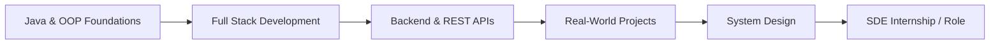

<div align="center">

<!-- Dynamic Gradient Banner -->


<!-- Typing Animation -->


<br/>

<!-- Badges -->
<p>
  
  &nbsp;
  
  &nbsp;
  
</p>

<p>
  <a href="https://linkedin.com/in/aman-jain-8b1868326"></a>
  <a href="https://github.com/AmanJainx0"></a>
  <a href="https://amanjainx0.github.io/Portfolio/"></a>
  <a href="mailto:amanjainx0@gmail.com"></a>
</p>

</div>

<br/>


## 👨‍💻&nbsp; About Me

<table width="100%">
<tr>
<td width="60%" valign="top">

I'm a Computer Science undergraduate who fell in love with **Java & Object-Oriented Programming**, and grew that into a genuine passion for **Full Stack** and **Backend Development**.

I like software that actually *does something useful* — which is why I gravitate toward backend systems, databases, REST APIs, and authentication flows rather than just UI polish. I learn best by shipping real, working projects instead of tutorials.

Alongside building, I'm sharpening my problem-solving through consistent **Data Structures & Algorithms** practice — one sheet, one problem, one day at a time.

> 🎯 **Long-term goal:** become a **Software Development Engineer (SDE)** and build software that people genuinely rely on.

</td>
<td width="40%" valign="top">

```typescript
const aman: Developer = {
  role        : "Java Developer",
  focus       : "Backend & Full Stack",
  education   : "B.Tech CSE, MIT (2023–27)",
  location    : "Uttar Pradesh, India",
  building    : ["Hostel Dominion", "TechBrat"],
  learning    : "DSA · System Design",
  funFact     : "Debugs better with ☕ than 🧃",
};
```

</td>
</tr>
</table>

<br/>

<table width="100%">
<tr>
<td align="center" width="20%">🔭<br/><b>Building</b><br/><sub>Hostel Dominion & TechBrat</sub></td>
<td align="center" width="20%">🌱<br/><b>Learning</b><br/><sub>System Design & Cloud</sub></td>
<td align="center" width="20%">💬<br/><b>Ask me about</b><br/><sub>Java, Node.js, REST APIs</sub></td>
<td align="center" width="20%">🧮<br/><b>Practicing</b><br/><sub>Striver A2Z DSA Sheet</sub></td>
<td align="center" width="20%">📫<br/><b>Reach me</b><br/><sub>amanjainx0@gmail.com</sub></td>
</tr>
</table>


## 📊&nbsp; GitHub Stats & Activity

<div align="center">


<br/><br/>


<br/><br/>


</div>


## 🎓&nbsp; Education

<table width="100%">
<tr>
<td align="center">

### 🏛️ Meerut Institute of Technology
**B.Tech — Computer Science & Engineering**
📍 Meerut, Uttar Pradesh, India &nbsp;|&nbsp; 📅 2023 – 2027

`Java` &nbsp;`Full Stack Development`&nbsp; `Data Structures`&nbsp; `Database Design`&nbsp; `OOP`

</td>
</tr>
</table>


## 🛠️&nbsp; Tech Stack

<div align="center">

**Languages**


**Frontend**


**Backend**


**Databases**


**Computer Vision**


**Developer Tools**


</div>

<details>
<summary><b>📈 See my current learning stack</b></summary>
<br/>

| Area | Focus |
|---|---|
| 🧠 Core | Advanced Java, OOP Design Patterns |
| 🔗 Backend | REST API Design, Database Optimization |
| 🏗️ Architecture | System Design fundamentals |
| ☁️ Cloud | Cloud Computing basics |
| 🧮 DSA | Striver A2Z Sheet (daily) |

</details>


## 🚀&nbsp; Featured Projects

<table width="100%">
<tr>
<td width="50%" valign="top">

### 🏨 Hostel Dominion
**A modern Hostel Management Platform** for students, wardens, and administrators — built to make daily hostel operations simple and reliable.

<details>
<summary><b>✨ Key Features</b></summary>
<br/>

- 🔐 Role-Based Authentication
- 🧑‍🎓 Student Management
- 🛏️ Room Allocation
- 📸 Biometric Face Recognition Attendance
- 💰 Fee Management
- 🗓️ Leave Management
- 📝 Complaint Management
- 🚪 Visitor Management
- 📊 Reports & Analytics
- 📢 Notice Management

</details>

`React` `Node.js` `Express.js` `PostgreSQL` `JWT` `Supabase` `FastAPI` `OpenCV` `MediaPipe`

[](https://github.com/AmanJainx0)

</td>
<td width="50%" valign="top">

### 🎓 TechBrat
**An AI-powered Career Guidance Platform** helping students navigate their path into tech with structured, practical guidance.

<details>
<summary><b>✨ Key Features</b></summary>
<br/>

- 🗺️ Career Roadmaps
- 🎤 Interview Preparation
- 📄 Resume Guidance
- 📚 Learning Resources
- 🎯 Career Recommendations

</details>

`React` `Node.js` `MongoDB` `JavaScript`

[](https://github.com/AmanJainx0)

</td>
</tr>
<tr>
<td width="50%" valign="top" colspan="2">

### 🧮 DSA Striver Repository
Optimized **Java** solutions for the complete **Striver A2Z DSA Sheet** — a daily log of my problem-solving practice, built one problem at a time.

`Java`

[](https://github.com/AmanJainx0)

</td>
</tr>
</table>


## 🏆&nbsp; Achievements

<table width="100%">
<tr>
<td align="center" width="33%">🛠️<br/><b>Full Stack Apps</b><br/><sub>Built multiple end-to-end projects</sub></td>
<td align="center" width="33%">☕<br/><b>Java & OOP</b><br/><sub>Strong core fundamentals</sub></td>
<td align="center" width="33%">🔐<br/><b>Auth Systems</b><br/><sub>REST APIs & JWT-based auth</sub></td>
</tr>
<tr>
<td align="center" width="33%">🗄️<br/><b>Database Design</b><br/><sub>Relational & NoSQL modeling</sub></td>
<td align="center" width="33%">📸<br/><b>Biometric Integration</b><br/><sub>Face recognition attendance</sub></td>
<td align="center" width="33%">📈<br/><b>Consistent DSA</b><br/><sub>Daily Striver Sheet practice</sub></td>
</tr>
</table>


## 🧭&nbsp; Roadmap



<details>
<summary><b>🎯 Full breakdown of current focus & future goals</b></summary>
<br/>

**Current Focus**
- Building production-ready software (Hostel Dominion, TechBrat)
- Strengthening Backend Development skills
- Mastering Java
- Solving DSA consistently
- Learning System Design fundamentals
- Preparing for SDE internships

**Future Goals**
- 🚀 Become a Software Development Engineer
- 🧠 Master System Design
- ☁️ Learn Cloud Technologies
- 🌍 Contribute to Open Source
- 📦 Build products used by real people
- 📖 Keep learning every day

</details>


## 🤝&nbsp; Let's Collaborate

<div align="center">

| 💼 Open To | 🤝 Interests |
|---|---|
| SDE Internships · Full-Time Roles · Freelance Projects · Open Source | Backend Development · Full Stack Development · Java · Software Engineering |

<br/>

[](mailto:amanjainx0@gmail.com)
[](https://amanjainx0.github.io/Portfolio/)
[](https://linkedin.com/in/aman-jain-8b1868326)

</div>

<br/>

<div align="center">


<br/><br/>


</div>
